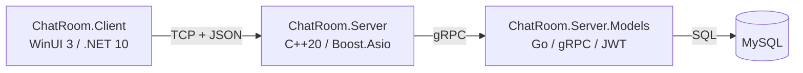

# ChatRoom 网络聊天室

基于 TCP + JSON 行协议的网络聊天室项目：WinUI 3 桌面客户端、C++ 网关服务端、Go 用户会话服务，支持注册登录、创建/加入房间、实时收发消息与心跳保活。

## 系统架构



| 模块 | 技术栈 | 说明 |
| ---- | ---- | ---- |
| [ChatRoom.Server](ChatRoom.Server) | C++20 / Boost.Asio / gRPC | TCP 网关：会话管理、房间动态生命周期、消息转发、心跳、配置化 |
| [ChatRoom.Server.Models](ChatRoom.Server.Models) | Go / gRPC / MySQL / JWT | 用户注册登录、bcrypt 密码哈希、会话签发与校验、注销黑名单 |
| [ChatRoom.Client.Core](ChatRoom.Client.Core) | C# / .NET 10 | 客户端网络核心：连接、API 请求/响应匹配、事件总线、配置 |
| [ChatRoom.Client](ChatRoom.Client) | C# / WinUI 3 | 桌面客户端：登录/注册、房间列表、聊天、创建房间 |

## 环境要求

| 依赖 | 版本/说明 |
| ---- | ---- |
| .NET SDK | 10.x |
| Visual Studio | 2022+（C++ 工具集 v145；本机 vcpkg 位于 `E:\App\vcpkg`） |
| vcpkg 包 | boost、nlohmann-json、grpc、spdlog（x64-windows） |
| protoc / grpc_cpp_plugin | 由 [Compile Protos.bat](Protos/Compile%20Protos.bat) 调用 |
| Go | 1.24+（go.mod 指定 1.25，Go 会自动下载匹配工具链） |
| MySQL | 8.0+（默认 127.0.0.1:3306） |

## 快速开始

### 1. 初始化数据库

```bash
mysql -u root -p < docs/sql/init.sql
```

脚本会创建 `chat_service` 库与 `user` 表（含昵称唯一索引）。连接信息在 `ChatRoom.Server.Models/Build/config.yaml` 中配置。

### 2. 启动 Go 用户会话服务（gRPC）

```bash
cd ChatRoom.Server.Models
go build -o Build/usersession.exe .
cd Build
./usersession.exe
```

默认监听 `:50051`；配置见 `Build/config.yaml`（端口、JWT 密钥、数据库连接）。

> 生产环境必须修改 `jwt_secret`（当前为本地开发占位值，启动时会告警）。

### 3. 启动 C++ 网关服务端

先用 [Compile Protos.bat](Protos/Compile%20Protos.bat) 生成 gRPC 代码，再用 Visual Studio 打开 `ChatRoom.slnx` 编译并运行 `ChatRoom.Server`，默认监听 `12345`。

配置见 `server.json`（端口、gRPC 地址、心跳间隔、空闲超时、消息长度、系统房间列表）；缺省使用代码内置默认值。

### 4. 启动客户端

Visual Studio 打开 `ChatRoom.slnx`，运行 `ChatRoom.Client`（WinUI 3）。连接配置见 `ChatRoom.Client.Core/ChatClient.yaml`。

## 测试

```bash
# Go 单元测试
cd ChatRoom.Server.Models && go test ./...

# .NET 单元测试
dotnet test ChatRoom.Client.Core.Tests/ChatRoom.Client.Core.Tests.csproj

# 服务端端到端集成回归（需先启动 MySQL）
powershell -ExecutionPolicy Bypass -File scripts/server_integration_test.ps1
```

## 目录结构

```text
ChatRoom/
├── ChatRoom.Server/            # C++ 网关服务端
├── ChatRoom.Server.Models/     # Go 用户会话服务
├── ChatRoom.Client.Core/       # 客户端网络核心（.NET）
├── ChatRoom.Client/            # WinUI 3 客户端
├── ChatRoom.Client.Core.Tests/ # 客户端核心单元测试
├── Protos/                     # gRPC 协议定义与编译脚本
├── docs/
│   ├── README.md               # 文档站首页（项目说明）
│   ├── api.md                  # API 协议
│   ├── event.md                # Event 协议
│   ├── 编码规范.md              # 编码规范
│   ├── sql/init.sql            # 数据库初始化脚本
│   └── plans/                  # 项目规划与阶段文档
├── scripts/                    # 集成回归测试脚本
└── .github/workflows/          # CI
```

## 协议速览

- [API](docs/api.md)：`register/login/logout/create_room/get_room_list/join_room/send_message/heartbeat`
- [Event](docs/event.md)：`message/notice/update/heartbeat`
- 协议约定：JSON 每行一条、`\n` 结尾；`echo` 唯一匹配响应；登录后所有 API 携带 `session_token`；消息广播不含发送者本人。

## 文档索引

- [文档站首页](docs/README.md)（含架构与模块说明）
- [项目总体规划](docs/plans/README.md)（阶段划分、验收标准）
- [编码规范](docs/编码规范.md)

## 已知限制

- 注销 token 黑名单为内存实现，服务重启后失效（生产可替换 Redis）。
- gRPC 调用为同步调用（网关单线程事件循环内执行，当前规模毫秒级）。
- 传输层未启用 TLS（生产部署建议在网关前加反向代理加密）。

