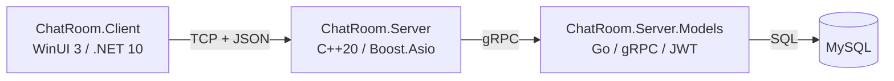

# 网络聊天室

## 项目简介

一个基于 TCP + JSON 行协议的网络聊天室项目，包含桌面客户端、C++ 网关服务端与 Go 用户会话服务三个子系统，支持注册、登录、创建房间、加入房间、实时收发消息与心跳保活。

## 系统架构



## 模块说明

| 模块 | 技术栈 | 职责 |
| ---- | ---- | ---- |
| [ChatRoom.Server](../../ChatRoom.Server) | C++20 / Boost.Asio / gRPC | TCP 网关：连接与会话管理、房间动态生命周期、消息转发、心跳保活、配置化 |
| [ChatRoom.Server.Models](../../ChatRoom.Server.Models) | Go / gRPC / MySQL / JWT | 用户注册登录、会话签发与校验（登录/注册/注销/会话校验） |
| [ChatRoom.Client.Core](../../ChatRoom.Client.Core) | C# / .NET 10 | 客户端网络核心：连接、API 请求/响应匹配、事件分发、配置读取 |
| [ChatRoom.Client](../../ChatRoom.Client) | C# / WinUI 3 | 桌面客户端 UI：登录/注册窗口、房间列表、消息聊天界面 |

## 通信协议

- [API](api.md)：客户端 → 服务端的请求/响应协议（注册、登录、注销、建房、进房、发消息、心跳等）
- [Event](event.md)：服务端 → 客户端的事件推送协议（消息、通知、房间列表更新、心跳）

## 目录结构

```text
ChatRoom/
├── ChatRoom.Server/            # C++ 网关服务端
├── ChatRoom.Server.Models/     # Go 用户会话服务
├── ChatRoom.Client.Core/       # 客户端网络核心（.NET）
├── ChatRoom.Client/            # WinUI 3 客户端
├── ChatRoom.Client.Core.Tests/ # 客户端核心单元测试
├── Protos/                     # gRPC 协议定义与编译脚本
├── docs/
│   ├── README.md               # 本页：项目说明
│   ├── api.md                  # API 协议
│   ├── event.md                # Event 协议
│   └── plans/                  # 项目规划与阶段文档
└── scripts/                    # 集成测试脚本
```

## 文档索引

- [项目总体规划与阶段划分](plans/README.md)
- [API 协议](api.md)
- [Event 协议](event.md)
- [编码规范](编码规范.md)

> 详细的环境要求、构建与运行步骤将在工程化阶段补充（见 [总体规划](plans/README.md) Stage 5）。
