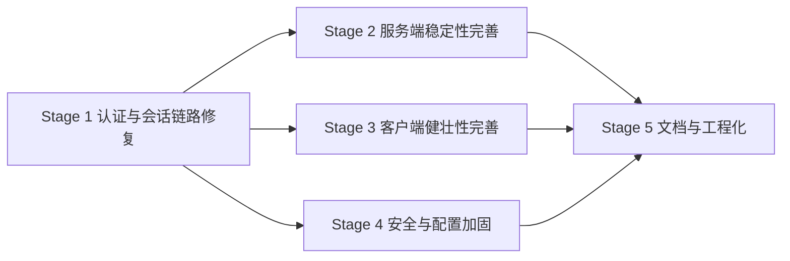

# ChatRoom 项目完善总体规划

> 状态：✅ 全部阶段已完成（待最终验收）
> 版本：v1.0 | 更新日期：2026-08-14

## 一、项目背景与目标概述

### 背景

ChatRoom 是一个网络聊天室项目，分为三个子系统：

| 子系统 | 技术栈 | 职责 |
| ------ | ------ | ---- |
| ChatRoom.Server | C++20 / Boost.Asio / gRPC | TCP 网关，处理客户端连接、房间、消息转发 |
| ChatRoom.Server.Models | Go / gRPC / MySQL / JWT | 用户注册登录、会话签发与校验 |
| ChatRoom.Client（Core） | C# / .NET 10 / WinUI 3 | 桌面客户端与网络核心层 |

项目核心框架已完成（最近一次提交 `f6454c1`），但作者在提交说明中明确提到"还有一些 BUG 要改也不难，但我要做毕设了，这个项目只能暂停了"。本次完善的目标是：**在不大改架构的前提下，修复已知缺陷、补齐文档与工程化短板，让项目达到可构建、可运行、可演示、可交付的完成状态。**

### 目标

1. 修复认证与会话链路中的关键缺陷，使"注册 → 登录 → 进房 → 收发消息"全链路真实可用且身份校验有效。
2. 完善服务端稳定性：会话生命周期管理、房间人数/离开通知、心跳保活、配置化。
3. 完善客户端健壮性与体验：事件分发、断线重连、发送/滚动等交互细节。
4. 安全加固：密码哈希、密钥与连接串配置化、数据库初始化脚本。
5. 文档与工程化：根 README、API/Event 文档同步、CI、测试补充。

### 新增需求（2026-08-14 用户提出）

6. **房间动态管理**：客户端可以主动创建房间；用户创建的房间在空置（最后一名成员离开）后自动关闭，系统默认创建的几个房间常驻、不随空置关闭。

该需求的服务端部分（`create_room` API、房间生命周期、列表更新事件）纳入 **Stage 2**，客户端部分（创建房间 UI、列表动态增删）纳入 **Stage 3**。

## 二、现状盘点（调研结论）

### 已确认的关键缺陷

| # | 位置 | 问题 | 严重度 |
| - | ---- | ---- | ------ |
| B1 | `ChatRoom.Server.Models/Protos/gRPCUserSession/gRPCUserSession.go` | `ValidateSession` 判断写反：`IsValid = IsTokenExpired(...)`，过期/非法 token 反而被判为有效，等于认证形同虚设 | 🔴 严重 |
| B2 | `ChatRoom.Server/ChatServerService.cpp` | `do_accept` 中 `newSession` 为局部 `shared_ptr`，未在任何容器中保存，回调结束即析构、socket 被关闭，连接会被立即断开 | 🔴 严重 |
| B3 | `ChatRoom.Server/UserSession.cpp` | `HandleLogin` 只设置了 `nickname`，未设置 `userId`（恒为 0）；且登录响应未返回 `user_id` | 🔴 严重 |
| B4 | `ChatRoom.Client.Core/Network/ChatClientEventService.cs` | 事件总线按 `typeof(T).Name`（如 `MessageEvent`）订阅，却按 `post_type`（如 `message`）派发，键不匹配，收不到任何事件消息 | 🔴 严重 |
| B5 | `ChatRoom.Client/Function/ChatRoom/ChatRoomService.cs` | 登录/注册后不保存 `session_token`，所有后续 API 均以空 token 调用（B1 掩盖了该问题，修复 B1 后必须同步修复） | 🔴 严重 |
| B6 | `ChatRoom.Client/Function/ChatRoom/ChatRoomFunction.cs` | 解析发送人 ID 写成 `Data["id"]?.Value<int>("sender")`，字段不存在，ID 恒为 0 | 🟠 高 |
| B7 | 多个客户端服务 | `Dispose()` 直接 `throw new NotImplementedException()`（`ChatClientService`、`ChatClientAPIService`、`ChatClientEventService`、`ChatRoomService`） | 🟠 高 |
| B8 | `ChatRoom.Server/UserSession.cpp` | `HandleSendMessage` 将消息广播给包括发送者在内的所有人，客户端本地回显 + 事件回显会造成重复显示 | 🟠 高 |
| B9 | 服务端 | 登录接口响应缺少 `user_id` 字段，但客户端按该字段取值；注册客户端却多传 `user_id`（协议未定义） | 🟠 高 |
| B10 | `ChatRoom.Server/Main.cpp` 与 `ChatServerService.cpp` | 房间初始化逻辑混乱：构造函数已建 5 个房间，`StartAccept()` 后 `Main.cpp` 中再添加的 3 个房间是死代码（`ioContext.run()` 阻塞）；`AddChatRoom` 使用 `static int id` | 🟡 中 |
| B11 | Go 服务 | `main.go` 中 `Serve` 外层循环语义错误；`Logout` 仅校验 token 过期，无真正的注销（无黑名单/服务端状态）；`SessionInfoResponse` 注释与实现不符（注释 -1，实现 0） | 🟡 中 |
| B12 | 安全 | 密码明文入库；JWT 密钥硬编码 `your-secret-key-change-this`；MySQL DSN 硬编码 root 密码；无数据库初始化 SQL | 🔴 严重 |
| B13 | 工程化 | 无根 README、无 CI、文档与实现不一致（`api.md` 中 `actino` 拼写错误、`event.md` 中 heartbeat/update 未实现、login 返回字段缺失） | 🟡 中 |
| B14 | 客户端 | 事件总线无退订机制；`ChatClientAPIService.OnResponseReceived` 未移除等待项；重连仅置 `IsLoggedIn=false`，无自动重连/重登；注册页要求用户 ID 但服务端注册其实由数据库自增分配（需求矛盾） | 🟡 中 |

### 文档与代码一致性

- `docs/api.md`：`actino` 拼写错误；`join_room` 说明写错（"获取房间信息列表"）；`login` 返回字段缺 `user_id`；`register` 参数含客户端实际发送的 `user_id`（协议未定义）。
- `docs/event.md`：`heartbeat`、`update`（room_list）在文档中存在但服务端未实现；`notice` 只有 `join_room`，无 `leave_room`。

## 三、阶段划分

| 阶段 | 名称 | 目标 | 预估工时 | 依赖 |
| ---- | ---- | ---- | -------- | ---- |
| Stage 1 | 认证与会话链路修复 | 修复 B1/B3/B5/B9，打通"注册→登录→进房→收发消息"并保证 token 校验真实生效 | 1~1.5 天 | 无 |
| Stage 2 | 服务端稳定性完善 | 修复 B2/B8/B10/B11，增加会话持有、离开通知、房间人数事件、心跳、服务端配置；新增房间创建与动态生命周期 | 1~2.5 天 | Stage 1 |
| Stage 3 | 客户端健壮性完善 | 修复 B4/B6/B7/B14，完善重连与交互体验；新增创建房间 UI 与房间列表动态增删 | 1~1.5 天 | Stage 1 |
| Stage 4 | 安全与配置加固 | 修复 B12：密码哈希、密钥/连接串配置化、SQL 初始化脚本 | 0.5~1 天 | Stage 1 |
| Stage 5 | 文档与工程化 | 修复 B13：根 README、API/Event 文档同步、CI、测试补充、protoc 脚本修正 | 0.5~1 天 | Stage 1~4 |

### 阶段依赖关系

> Stage 2/3/4 相互独立，可在 Stage 1 批准并完成后并行或按序推进；Stage 5 收尾统一验收。

## 四、整体验收标准

- [ ] 全部子系统可本地构建通过（C++ Server / Go Models / .NET Core+Client）。
- [ ] 端到端演示通过：启动 MySQL + Go 服务 + C++ 服务 + 客户端，完成注册、登录、刷新房间、加入房间、双客户端互发消息、退出登录。
- [ ] token 校验真实生效：伪造/过期 token 的请求被拒绝；正确 token 的请求放行。
- [ ] 无 `NotImplementedException` 残留；所有 `Dispose` 可安全调用。
- [ ] 服务端可配置端口与 gRPC 地址；数据库连接串与 JWT 密钥不再硬编码于源码。
- [ ] 客户端可创建房间并自动加入；用户创建的房间清空后自动关闭并从列表消失，系统默认房间常驻。
- [ ] `docs/api.md`、`docs/event.md` 与实现一致；新增根 README 与构建运行说明。
- [ ] 新增单元测试（Go JWT/数据库、.NET Core 消息解析/事件分发）全部通过；GitHub Actions CI 覆盖 Go 与 .NET。

## 五、风险总览

| 风险 | 影响 | 应对 |
| ---- | ---- | ---- |
| C++ 工程依赖 vcpkg/本地工具链，环境差异大 | Stage 2 验证受限 | 优先做可独立验证的 Go/.NET 修复；C++ 修改配套日志与集成测试说明 |
| 会话持有方案改动涉及异步生命周期 | 连接泄漏或悬垂指针 | 采用 `shared_ptr` 会话表 + 弱引用清理，读错误时统一移除 |
| 修复 B1 后客户端旧逻辑（空 token）会立即失效 | 全链路不可用 | Stage 1 必须客户端与服务端同步修改并做集成验证 |
| MySQL 环境不可用 | Go 服务无法启动 | 提供 SQL 初始化脚本与 docker-compose（可选），单测用 sqlmock 隔离 |
| 文档与实现长期漂移 | 验收失真 | 每阶段完成时执行文档一致性检查，作为验收证据 |
